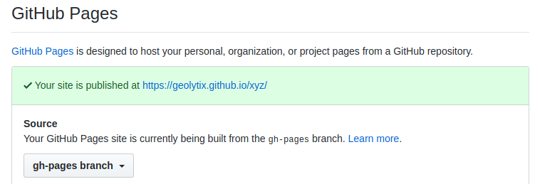

# How to Document

This article gives an overview of the XYZ documentation. Please refer to the information in order to contribute with new articles or edits to existing pages.

## gh-pages

The gh-pages branch of the XYZ repository contains all resources for this documentation. Pull requests or commits to this branch will update the documentation pages which are hosted through GitHub Pages.

## eleventy

We use [Eleventy](https://github.com/11ty/eleventy) to compile markdown and other resources into static pages.

eleventy must be installed via npm, either globally or into the current directory.

```
npm install @11ty/eleventy
```

Compile and serve the documentation pages locally by executing the eleventy module via npx.

```
npx eleventy --input ./_docs --output ./docs --formats=html,md --pathprefix=/xyz/docs --serve
```

While acting as a local webserver with the --serve flag eleventy will immediately compile changes detected in the input directory. The pathprefix option deploys the site to a subdirectory which is particularly helpful with GitHub pages.



Compiling the input directory /_docs will write html to the output directory /docs for static file hosting.

The .eleventy.js file in the root directory is required to order posts based on their file name, apply a markdown-it schema, and pass through images to the output directory.

Images as shown above should be included in the same directory as the markdown file and referenced like so.

``````

Eleventy will create a folder with an index.html file created from the markdown document in order for the static site navigation to work as expected. The image must therefore be referenced from the parent directory.

### _includes

The _includes directory contains a root.html template which is used to provide navigation and additional styles to compiled documentation pages.